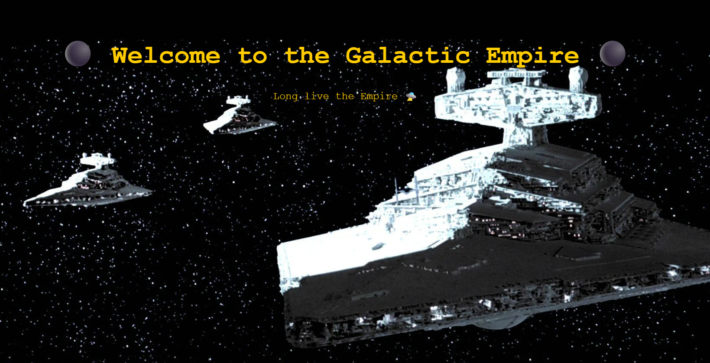

# 🚀 Star Wars ALB - EC2 Architecture

This project deploys a high-availability web architecture on AWS using EC2 + ALB with Star Wars flavor.

Each EC2 instance represents a faction: the Galactic Empire and the Rebel Alliance. A public Application Load Balancer distributes the traffic.

## 🛠️ Technologies

- Amazon EC2
- Application Load Balancer (ALB)
- Security Groups
- Amazon VPC
- User Data scripts
- HTML + CSS (inline)
- S3-hosted images
- Star Wars-themed visuals

## 📸 Screenshots

| Empire | Rebels |
|--------|--------|
|  |  |

## 🌐 Access

When deployed, the ALB DNS will show either:
- **Empire instance**: Yellow-themed, Imperial background
- **Rebel instance**: Blue-themed, Rebel background

### 🖼️ Background images are served from a **public S3 bucket** for fast and scalable asset delivery:
- ✅ Cost-efficient (uses S3 Static Website Hosting)
- ✅ Decouples media from EC2 logic
- ✅ Great for learning AWS IAM, bucket policies, and website configuration

## 🧠 What I Learned

- Configuring EC2 instances behind an ALB
- Customizing User Data scripts per instance
- Using EC2 metadata to dynamically print instance info
- Serving assets from S3 to reduce instance workload
- High availability architecture on AWS

## 📁 Structure

aws-ec2-alb-s3-imperial-vs-rebel-lab/
├── empire-user-data.sh
├── rebel-user-data.sh
├── screenshots/
│ ├── empire.png
│ └── rebels.png
├── README.md

## ☁️ S3 Hosting Tips

To serve assets via S3:
1. Create a bucket (e.g., `starwars-assets`)
2. Enable Static Website Hosting
3. Make objects public (via Bucket Policy)
4. Use the asset URLs directly in your HTML

---

This was part of my ongoing #RoadToAWS_SAA 🚀  
More labs on my GitHub 👉 https://github.com/dcanogi/AWS
