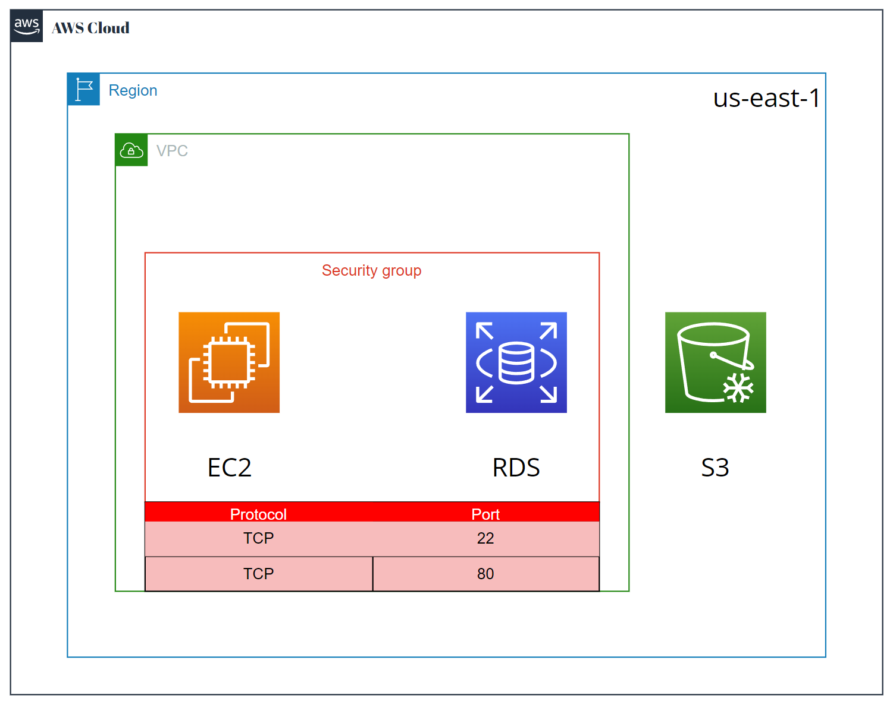

# Guía para Crear Recursos en AWS con AWS CLI 🚀

[🔗 Versión en inglés 🌍🇺🇸](readme.md)

Este documento explica los pasos para crear un grupo de seguridad, una instancia EC2, una base de datos RDS y un bucket S3 en AWS usando la CLI de AWS.



## 1. Crear un Grupo de Seguridad para EC2 🔐
Primero, creamos un grupo de seguridad para la instancia EC2.

```bash
aws ec2 create-security-group --group-name ec2-security-group --description "Security group for EC2" --region us-east-1
```

## 2. Autorizar los Puertos 22 (SSH) y 80 (HTTP) en el Grupo de Seguridad 🌐
Ahora, autorizamos el acceso a los puertos 22 (para SSH) y 80 (para HTTP) en el grupo de seguridad que acabamos de crear.

```bash
SECURITY_GROUP_ID=$(aws ec2 describe-security-groups --group-names ec2-security-group --query 'SecurityGroups[0].GroupId' --output text --region us-east-1)
aws ec2 authorize-security-group-ingress --group-id $SECURITY_GROUP_ID --protocol tcp --port 22 --cidr 0.0.0.0/0 --region us-east-1
aws ec2 authorize-security-group-ingress --group-id $SECURITY_GROUP_ID --protocol tcp --port 80 --cidr 0.0.0.0/0 --region us-east-1
```

## 3. Crear la Instancia EC2 💻
Ahora, creamos la instancia EC2. Asegúrate de tener el ID de la AMI (`ami-0c55b159cbfafe1f0` como ejemplo) y la clave SSH que usarás para acceder a la instancia.

```bash
aws ec2 run-instances --image-id ami-0c55b159cbfafe1f0 --count 1 --instance-type t2.micro --key-name my-aws-key --security-group-ids $SECURITY_GROUP_ID --query 'Instances[0].InstanceId' --output text --region us-east-1
```

## 4. Obtener la Dirección IP Pública de la Instancia EC2 🌍
Una vez que la instancia esté en ejecución, obtenemos su dirección IP pública.

```bash
aws ec2 describe-instances --instance-ids $INSTANCE_ID --query 'Reservations[0].Instances[0].PublicIpAddress' --output text --region us-east-1
```

## 5. Crear una Base de Datos RDS 🗄️
Creamos una base de datos MySQL en RDS. En este caso, utilizamos el nombre de la base de datos `mydb` y el nombre de usuario y contraseña proporcionados.
```bash
aws rds create-db-instance \
  --db-instance-identifier mydb-instance \
  --db-name mydb \
  --allocated-storage 20 \
  --db-instance-class db.t2.micro \
  --engine mysql \
  --master-username admin \
  --master-user-password mypassword123 \
  --backup-retention-period 7 \
  --no-multi-az \
  --publicly-accessible \
  --region us-east-1
```

## 6. Crear un Bucket S3 🗃️
Creamos un bucket S3 con el nombre `s3test`.

```bash
aws s3api create-bucket --bucket s3test --region us-east-1 --create-bucket-configuration LocationConstraint=us-east-1
```

## 7. Subir un Archivo de Prueba al Bucket S3 📂
Subimos un archivo de prueba llamado `test_file.txt` al bucket S3.

```bash
echo "Este es un archivo de prueba para S3" > test_file.txt
aws s3 cp test_file.txt s3://s3test/
```
